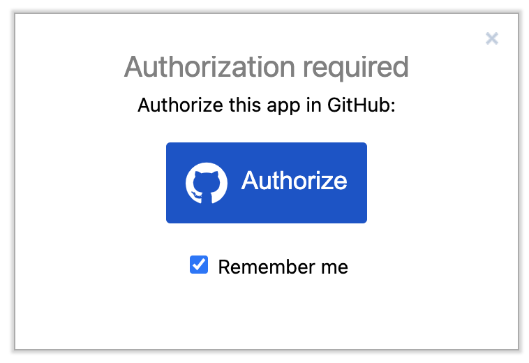
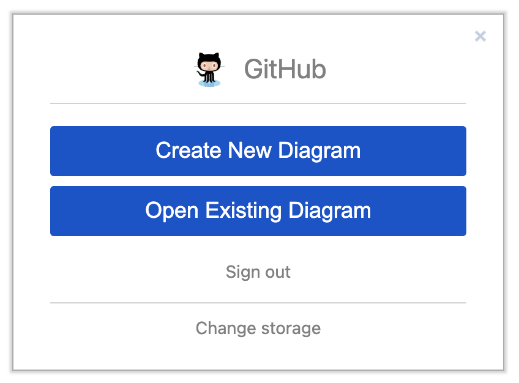
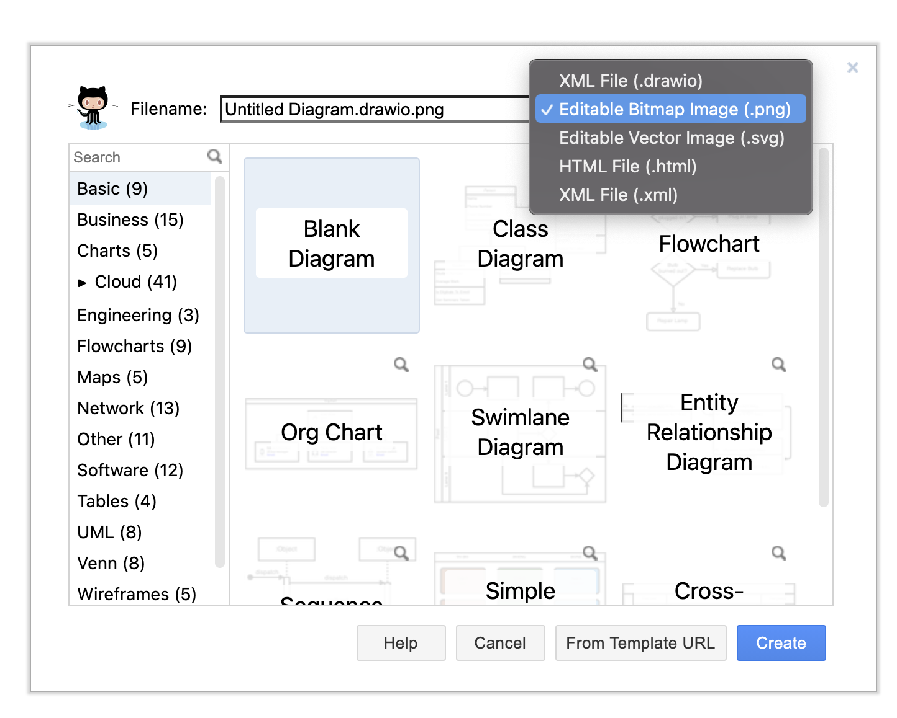

# github-drawio

How to use diagrams.net (draw.io) diagrams in your GitHub repo.

## Benefits of using diagrams.net in GitHub repositories

1. Diagrams are stored in your repository with your code and docs
2. Diagram access is controlled by GitHub repository access
3. Diagrams are version-controlled using git
4. Create PRs with diagram updates to get approvals and feedback
5. One-click diagram editing from your GitHub repository
6. diagrams.net is open-source: <https://github.com/jgraph/drawio>

## How to integrate diagrams.net (draw.io) with your GitHub repo

Note: Images in markdown are cached and can take five minutes to update

### Using github.dev (Recommended)

This method does not require any OAuth or GitHub app approvals and defaults to offline mode. 🎉

Using the [Draw.io Visal Studio Code extension], you can do this in github.dev, Codespaces or locally on VS Code.

1. Open the repository you want to create the diagram in
2. Press `.` to open github.dev (or use Codespaces, or clone and use VS Code locally)
3. Install the [Draw.io Visal Studio Code extension]
4. Open or save a file ending with `.drawio.png` or `.drawio.svg`
5. Reference the file in markdown like you would reference any file ``
6. It will now live-update, you can use PRs, and you didn't need to install any GitHub apps! 🚀

Reference: <https://github.com/hediet/vscode-drawio#readme>


### Using app.diagrams.net

This method requires getting the OAuth app installed and approved for your GitHub repository.

1. Open draw.io in GitHub mode (<https://app.diagrams.net/?mode=github>)
2. Authorize with GitHub
    - 
3. Choose the file you would like to edit OR Create a diagram in a new location
    - File should be editable bitmap image png or svg
    - 
    - 
4. Make changes, save and commit
5. Your svg (or png) file is now in your repo and contains a copy of your diagram in its metadata
6. In your markdown
    1. Reference the image like you would to any image
    2. On click, have the user navigate to diagrams.net and begin editing

    ```markdown
    [](https://app.diagrams.net/#Hphilip-gai/github-drawio/main/Test%20Embedding.drawio.svg)
    ```

Reference: <https://github.com/jgraph/drawio-github>


## Real Examples

### SVG

- Allows you to have clickable links
- Better quality than png

[](https://app.diagrams.net/#Hphilip-gai/github-drawio/main/Test%20Embedding.drawio.svg)

### PNG

[](https://app.diagrams.net/#Hphilip-gai/github-drawio/main/Test%20Embedding.drawio.png)

<!-- Links -->
[Rich Diffs]: https://docs.github.com/en/github/collaborating-with-pull-requests/proposing-changes-to-your-work-with-pull-requests/about-comparing-branches-in-pull-requests#diff-view-options
[Draw.io Visal Studio Code extension]: https://marketplace.visualstudio.com/items?itemName=hediet.vscode-drawio
